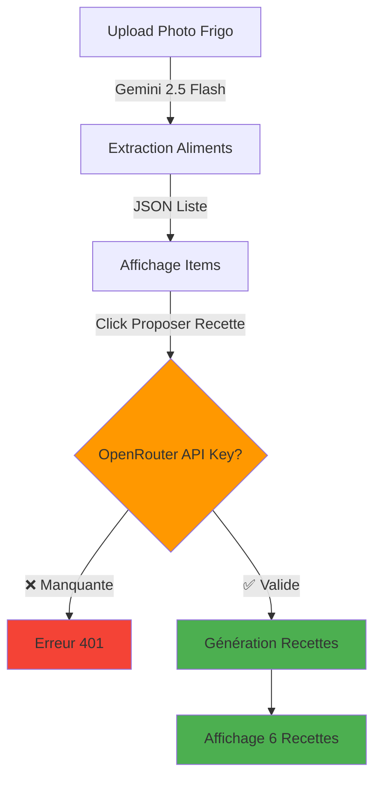

# Configuration de la Clé API OpenRouter

## ⚠️ Action Requise

Pour générer des recettes avec l'IA, vous devez configurer votre clé API OpenRouter.

## 📝 Étapes de Configuration

### 1. Obtenir une Clé API OpenRouter

1. Visitez https://openrouter.ai/
2. Créez un compte gratuit
3. Générez une clé API dans votre dashboard
4. Copiez la clé (format: `sk-or-v1-...`)

### 2. Configuration du Fichier

Le fichier `lib/config/api_config.dart` existe déjà. Ouvrez-le et remplacez:

```dart
static const String openRouterApiKey = 'YOUR_OPENROUTER_API_KEY_HERE';
```

Par votre vraie clé:

```dart
static const String openRouterApiKey = 'sk-or-v1-VOTRE_CLE_ICI';
```

### 3. Modèles Disponibles

Le fichier est configuré avec:
- **Modèle actuel**: `mistralai/mistral-small-3.1-24b-instruct:free`

#### Pour utiliser 2 modèles différents:

Vous pouvez modifier `recipe_service.dart` pour alterner entre 2 modèles, par exemple:
- `mistralai/mistral-small-3.1-24b-instruct:free`
- `meta-llama/llama-3.2-3b-instruct:free`
- `google/gemini-2.0-flash-exp:free`

## ✅ Vérification

Une fois configuré, vous devriez:

1. **Scanner votre frigo** → Les aliments sont détectés (✅ Fonctionne avec Gemini 2.5 Flash)
2. **Cliquer sur "Proposer une recette"** → Les recettes sont générées (❌ Nécessite la clé API)

## 🔒 Sécurité

- ✅ Le fichier `api_config.dart` est dans `.gitignore`
- ✅ Votre clé ne sera JAMAIS commitée sur Git
- ✅ Gardez votre clé confidentielle

## 🐛 Dépannage

### Erreur 401: "No cookie auth credentials found"
→ **Cause**: Clé API manquante ou invalide  
→ **Solution**: Vérifiez que vous avez remplacé `YOUR_OPENROUTER_API_KEY_HERE` par votre vraie clé

### Les recettes ne se génèrent pas
→ **Vérifiez la console du navigateur** (F12) pour voir les messages d'erreur détaillés  
→ La nouvelle version affiche maintenant des messages clairs:
```
❌ OpenRouter API Authentication Error (401)
⚠️  API Key manquante ou invalide dans api_config.dart
💡 Visitez https://openrouter.ai/ pour obtenir une clé API gratuite
```

## 📊 Workflow Complet



## 🎯 Résumé

- **Détection d'aliments**: ✅ **FONCTIONNE** (Gemini 2.5 Flash via server Node.js)
- **Génération de recettes**: ⏳ **ATTEND VOTRE CLÉ API** (OpenRouter)
- **Images fixes**: ✅ **CORRIGÉES** (URLs Unsplash à jour)
- **Messages d'erreur**: ✅ **AMÉLIORÉS** (indications claires)

---

**Une fois la clé configurée, tout devrait fonctionner parfaitement! 🚀**
